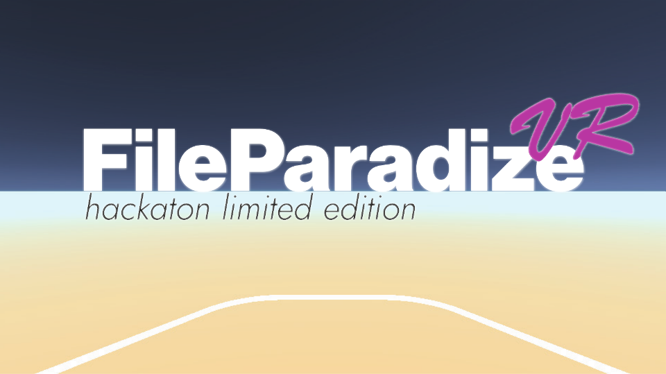

# File Paradize VR

[Clarte](https://www.clarte-lab.fr), a consulting firm in Virtual and Augmented Reality, organized a 2-day hackathon in their office at the [Laval Virtual Center](http://http://lavalvirtualcenter.com/en/).

They supplied us with an HTC Vive Focus at first (6DoF headset and 3DoF controller), and then we switched to an HTC Vive (6DoF headset and 2 3DoF controllers).

# Concept

The prompt:

> In 2030, what Virtual Reality will improve your day to day life

We thought about what things were annoying to do, and settled on managing paperwork. It's always a pain to find the right files for the right thing, sometimes you need only a paragraph for your research.

On a computer, it's messy having to switch windows all the time, and on a desk, you quickly run out of space. So let's make use of the infinite paper space of Virtual Reality!

And since it's a computer, we can also implement all sorts of sorting, tagging, filtering functions in our application.

# Proof of Concept

We built it using Unity.

**NB:** the paper is [Hinged Dissections Exist](https://arxiv.org/abs/0712.2094v1). A video of it in action is available on Reddit: [click here](https://www.reddit.com/r/interestingasfuck/comments/bd56eq/hinged_dissections_between_a_triangle_a_square/)

# The team

Corentin Gilbert, Alexandre Hua, Christopher Lesdalons, Thomas Oppman

GitHub might show that all commits were done by Tilwa Qendov, but that's because we used the same email address for two computers. There are three authors "Groupe", "Tilwa Qendov" and "CG".

# License

Our code is licensed under the [MIT License](LICENSE).  
Our assets are licensed under [CC-BY 4.0](https://creativecommons.org/licenses/by/4.0/)
